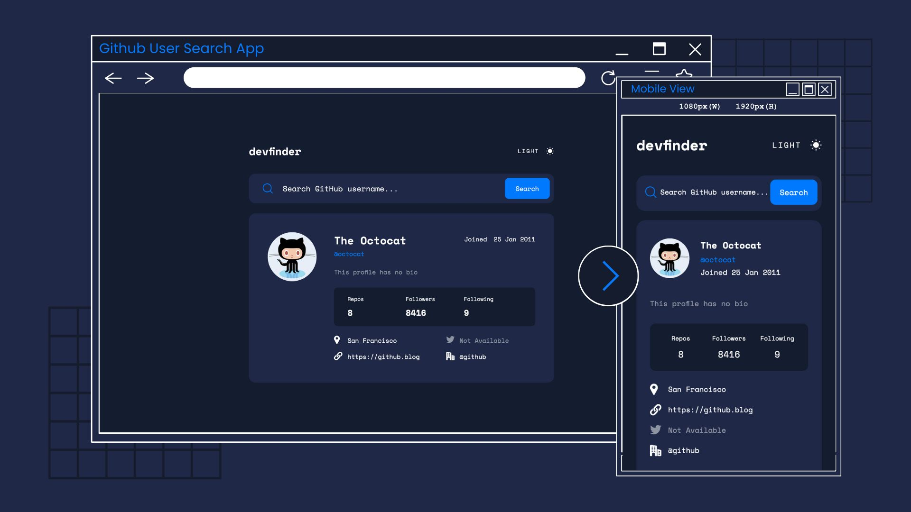
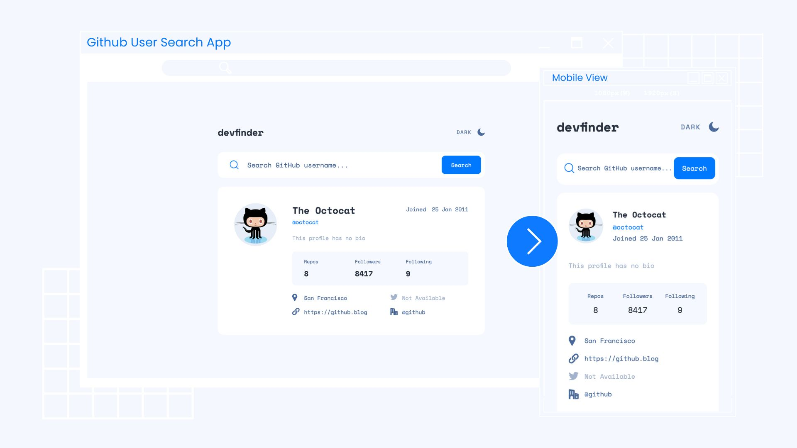

# Frontend Mentor - Notifications page solution

[](https://app.netlify.com/sites/github-user-search-app-erj/deploys)

This is a solution to the [GitHub user search app challenge on Frontend Mentor](https://www.frontendmentor.io/challenges/github-user-search-app-Q09YOgaH6). Frontend Mentor challenges help you improve your coding skills by building realistic projects.

## Table of contents

- [Frontend Mentor - Notifications page solution](#frontend-mentor---notifications-page-solution)
  - [Table of contents](#table-of-contents)
  - [Overview](#overview)
    - [The challenge](#the-challenge)
    - [Screenshot](#screenshot)
    - [Links](#links)
  - [My process](#my-process)
    - [Built with](#built-with)
    - [What I learned](#what-i-learned)
    - [Continued development](#continued-development)
    - [Useful resources](#useful-resources)
  - [Author](#author)
  - [Acknowledgments](#acknowledgments)

## Overview

### The challenge

Users should be able to:

- View the optimal layout for the app depending on their device's screen size
- See hover states for all interactive elements on the page
- Search for GitHub users by their username
- See relevant user information based on their search
- Switch between light and dark themes
- Have the correct color scheme chosen for them based on their computer preferences.
- Persist theme with localStorage

### Screenshot





### Links

- Solution URL: [https://github.com/ereljapco/fem-github-user-search-app](https://github.com/ereljapco/fem-github-user-search-app)
- Live Site URL: [https://github-user-search-app-erj.netlify.app/](https://github-user-search-app-erj.netlify.app/)

## My process

### Built with

- Semantic HTML5 markup
- CSS custom properties
- Flexbox
- CSS Grid
- Mobile-first workflow
- [React](https://reactjs.org/) - JS library
- Fetch API
- [Github API](https://docs.github.com/en/rest/users/users?apiVersion=2022-11-28)
- [date-fns](https://date-fns.org/) - Modern JS date utility library

### What I learned

- Components made it easier for me to focus on one feature at a time rather.
- Make the features work first before working on the design.
- Setting the background-color of `input` to transparent works well in Firefox, but with Chrome's autocomplete, it adds a background-color. Something to work on in the future 🛠️

```css
.search-form__input {
  width: 100%;
  color: inherit;
  font-family: inherit;
  font-size: 0.78rem;
  background-color: transparent;
  border-color: transparent;
}
```

### Continued development

Features in the Future:

- [ ] change the `border-color` of the `.search-form` if there are no results
- [ ] fix the `background-color` of the `.search-form__input` on Chrome

### Useful resources

## Author

- Frontend Mentor - [@ereljapco](https://www.frontendmentor.io/profile/ereljapco)
- LinkedIn - [/in/ereljapco](https://www.linkedin.com/in/ereljapco/)

## Acknowledgments

I don't have a Frontend Mentor Pro account so I based the design from the photos available at the website and from [NinjaInShade](https://github.com/NinjaInShade)'s live site. Thank you!
